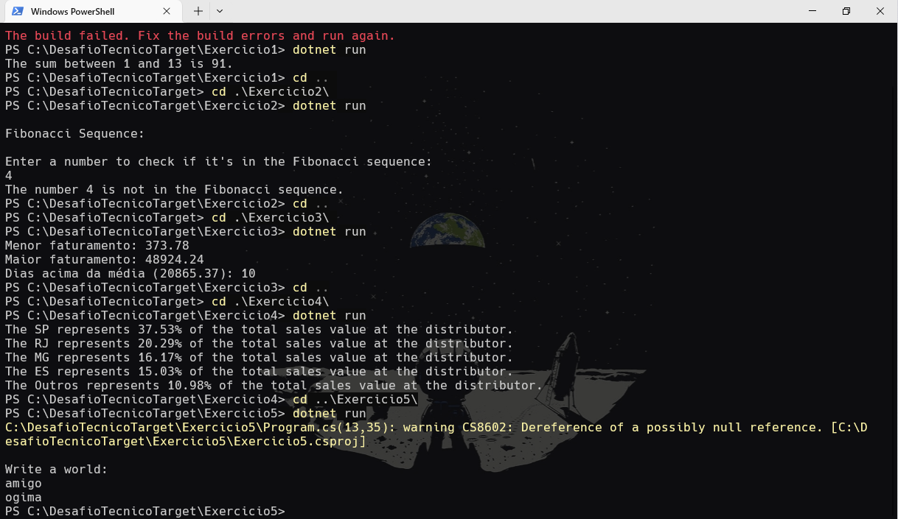

# Desafio Técnico para Target Sistemas
## Pré-requisitos
- [.NET SDK](https://dotnet.microsoft.com/download) instalado (versão 6.0 ou superior recomendada)
- Editor de código como [Visual Studio Code](https://code.visualstudio.com)
- Terminal (integrado ou externo)
- Git 
## Como rodar?
### Clonar este repositório
```bash
git clone https://github.com/seu-usuario/exercicios-logica-csharp.git
```
### Ir para a pasta de cada exercício
```bash
cd DesafioTecnicoTarget\Exercicio[1-5]
```
### Executar o comando abaixo na pasta do exercício
```bash
dotnet run
```

## Resultados

